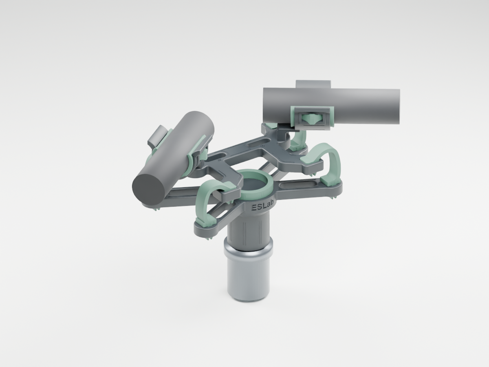
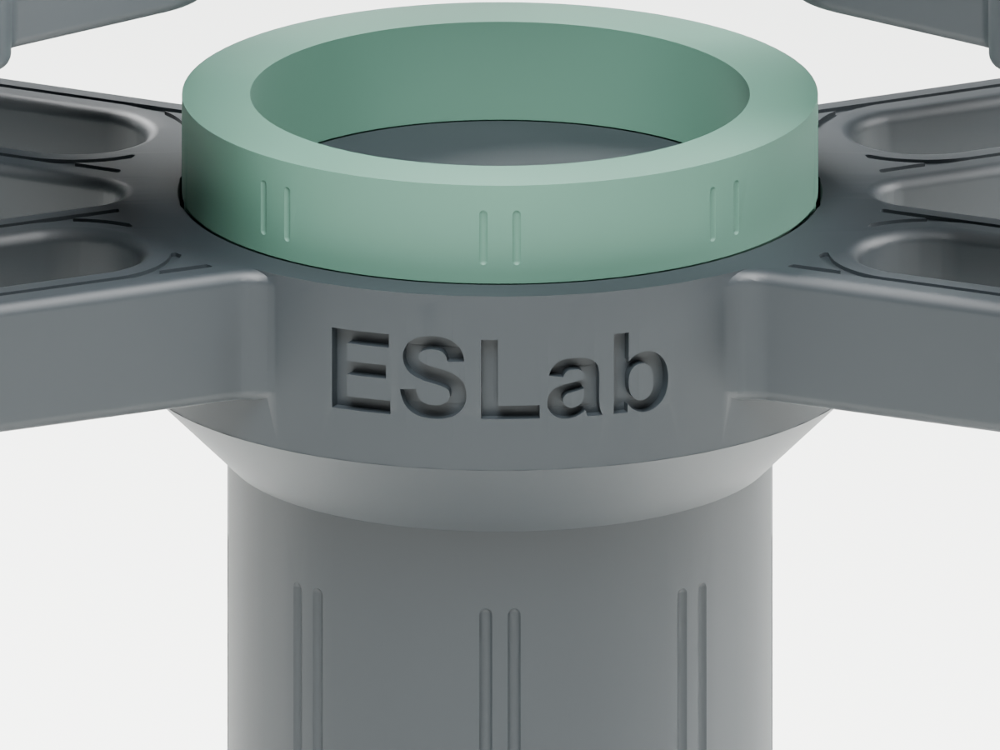
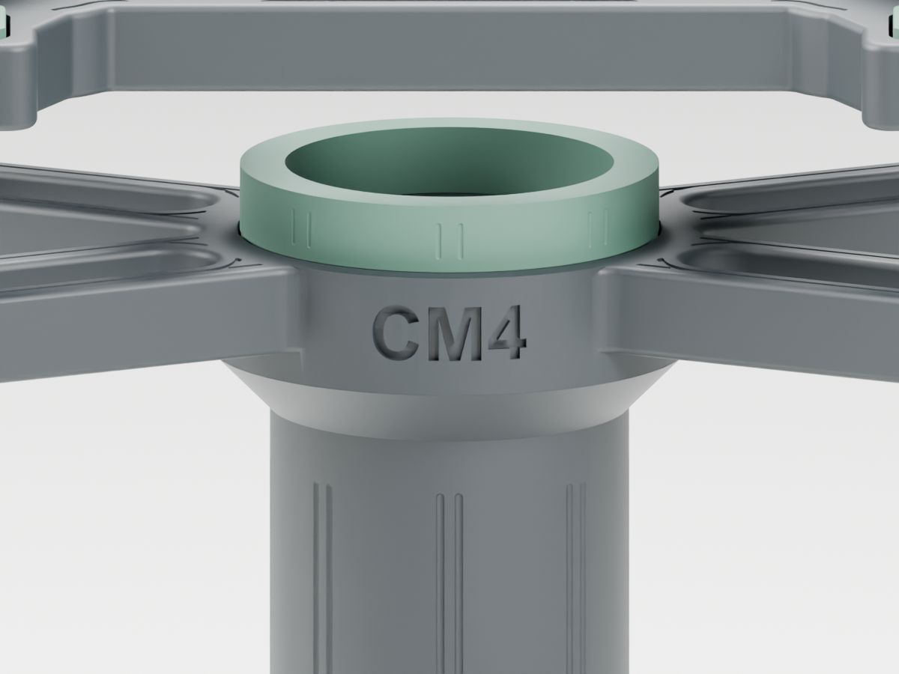
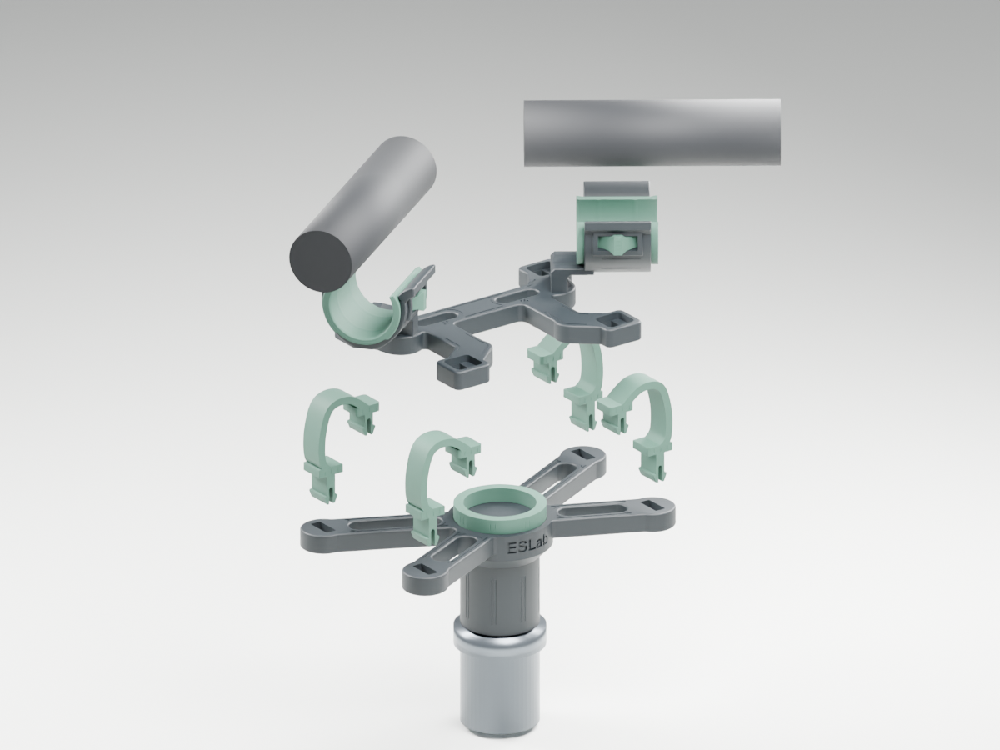

# ESLab CM4 ORTF v1.1

A compact indoor stereo microphone mount for two Line Audio CM4 microphones, with a fixed nominal ORTF layout, PETG-CF frame and replaceable TPU 95A suspension/liners.

**Free downloads for non-commercial use — CC BY-NC-ND 4.0. No commercial license is granted.** Credit ESLab (Eternal Sound Lab), retain the attribution and license; do not distribute modified versions. See [NOTICE](NOTICE.md) and [license](LICENSE.txt).

## Download and print

Download [the complete ZIP](ESLab-CM4-ORTF-v1.1-CC-BY-NC-ND.zip), or open [PETG-CF plate](01-PETG-CF-P2S.3mf) and [TPU plate](02-TPU95A-P2S.3mf) as Bambu Studio **projects**, preserving object overrides and orientations. Print each plate once for a complete nine-part set. Individual STL files in this repository are included for other slicers; their orientations match the print baseline.

| P2S 0.4 mm plate | Parts | Material | Supports | Slicer estimate |
|---|---|---|---|---|
| 01-PETG-CF-P2S.3mf | Base + floating carrier (2) | ELEGOO PETG-CF | Carrier only; base disabled via object override | 3h 34m / 42.29 g including support |
| 02-TPU95A-P2S.3mf | Four flexures + two liners + central bumper (7) | ELEGOO TPU 95A | None | 1h 50m / 13.63 g |

Keep **by-layer printing** and 100% model scale. The PETG-CF profile uses 0.16 mm layers, 5 walls and 35% gyroid infill. TPU uses 0.20 mm layers, 3 walls and 100% rectilinear infill. Dimensions/geometry are unchanged by the two-plate arrangement. No machine G-code is distributed. Printer preparation time may differ.

## Branding

The base has real recessed **ESLab** lettering on the front and **CM4** on the rear, approximately 3.8 mm high and 0.5 mm deep. It is included in both the STL and PETG-CF print profile.

## Intended setup

- Two CM4 bodies: nominal diameter 20 mm, length 77 mm; owner-confirmed mass 30 g each.
- Nominal front reference spacing 170 mm, axis angle 110 degrees. Internal diaphragm setback has not been measured.
- Original On-Stage QK2BC quick-release hardware; printed 5/8-27 female interface uses the owner-tested 0.15 mm radial compensation. Quick-release hardware and microphones are not printable parts in this package.
- Tool-free soft liners and split suspension anchors; intended for indoor piano / concert-hall recording.
- No cable-specific mounting features. Leave slack in the microphone cables so they do not constrain the floating carrier.

## Assembly

1. Remove the carrier supports and clear strings from all sockets and split anchor slots.
2. Seat the central bumper in the base groove and engage both latches.
3. Install the four flexures, lower ends first. **Longer anchor necks connect to the base; shorter necks connect to the floating carrier.** Curved ribbons bow outward. Align each anchor's long edge with the socket, pinch both split barbs and push through until both rebound. Do not pull on the ribbon.
4. Latch each TPU liner into both carrier windows. Open the soft lips to install the microphones; do not force the PETG-CF clip edges apart.
5. Align the microphone tail to the long witness mark. Short adjacent marks are 1 mm apart. Microphone axial retention is by TPU friction, not a mechanical lock on the microphone body.
6. Attach the original quick release, connect cables with slack and check that the floating frame is level and does not touch rigid parts during normal loading.

[中文详细装配说明](装配说明.md)

## Validation and limits

This is the **v1.1 frozen print baseline**, geometry ID `99acfbc5fd`. Mesh/assembly checks and both merged-plate slices passed. The owner confirmed the thread fit, liner fit and upper split-anchor coupon fit. The integrated lower anchor has a longer neck and still requires full-assembly fit confirmation. Load deflection, isolation performance, fatigue, creep and drop resistance have not been established by physical tests. Supplied images are renders of the actual model, not photos of a fully validated final print.

If you already have v0.17 hard parts, liners and bumper, v1.0 changed the four suspension flexures; v1.1 additionally engraves ESLab on the front and CM4 on the rear of the base. Other parts are unchanged.

## 中文概述

面向室内钢琴／音乐厅录音的 Line Audio CM4 专用 ORTF 支架。整套九件分两盘打印：PETG-CF 硬件一盘，TPU 95A 减震件和内衬一盘。底座接原装 On-Stage QK2BC 快拆，角度与名义参考间距固定。

**免费非商业使用，禁止商用。采用 CC BY-NC-ND 4.0：转载需署名，不允许分享修改版，私人非商业修改可以。** 这是带非商业限制的设计共享，不宣称为不限制用途的开源硬件。

文件已通过数字模型与切片检查；已确认的试配项目与整机尚未实测项目列在上方。图像为模型渲染，非实物照片。
